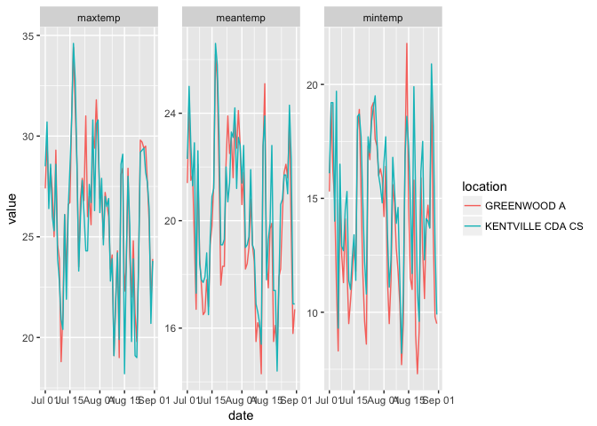
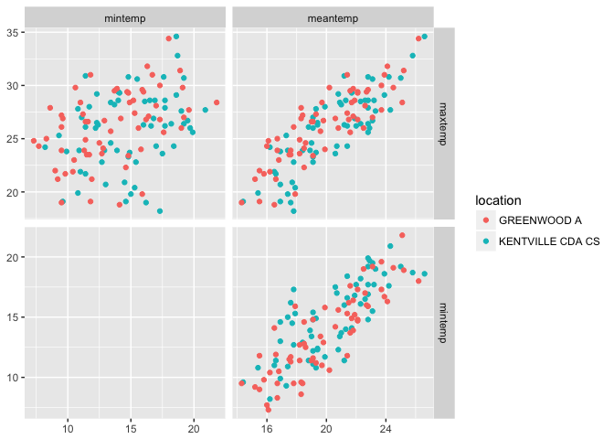
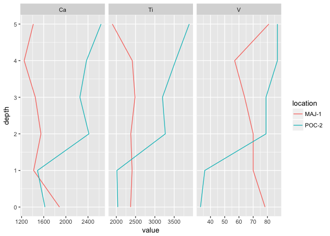
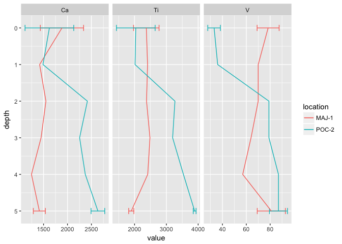

R package 'mudata'
================
Dewey Dunnington
February 26, 2017

[](https://cran.r-project.org/package=mudata)

The 'mudata' package for R is a set of tools to create, manipulate, and visualize multi-parameter, spatiotemporal data. Data of this type includes all data where multiple parameters (e.g. wind speed, precipitation, temperature) are measured along a common axis (e.g. time, depth) at discrete locations (e.g. climate stations). These data include long-term climate data collected from climate stations, paleolimnological data, ice core data, and ocean core data among many others. Data of this type is often voluminous and difficult to organize given its multi-dimensional nature. The (mostly) universal data (mudata) format is an attempt to organize these data in a common way to facilitate their documentation and comparison.

Installation
------------

The `mudata` package is in active development and can be installed from GitHub:

``` r
# install.packages("devtools")
devtools::install_github("paleolimbot/mudata")
```

The MUData format
-----------------

The (mostly) universal data format is a collection of five (or more) tables, one of which contains the data in a molten form (see [tidyr](https://cran.r-project.org/package=tidyr)). The easiest way to visualize a mudata object is to inspect the `kentvillegreenwood` dataset within the package. This object is a collection of daily observations from Kentville, Nova Scotia, and Greenwood, Nova Scotia from July and August, 1999.

``` r
library(mudata)
library(ggplot2)
data("kentvillegreenwood")
autoplot(kentvillegreenwood)
```


The default `plot()` function for a `mudata` object uses [ggplot2](https://cran.r-project.org/package=ggplot2) to produce a faceted plot comparing locations and datasets by parameter. However, if we take a look at the structure of the object, we can see that it is just a `list` of 5 `data.frame` objects.

``` r
str(kentvillegreenwood)
```

    ## List of 5
    ##  $ data     :Classes 'tbl_df', 'tbl' and 'data.frame':   1364 obs. of  6 variables:
    ##   ..$ dataset : chr [1:1364] "ecclimate" "ecclimate" "ecclimate" "ecclimate" ...
    ##   ..$ location: chr [1:1364] "KENTVILLE CDA CS" "KENTVILLE CDA CS" "KENTVILLE CDA CS" "KENTVILLE CDA CS" ...
    ##   ..$ param   : chr [1:1364] "maxtemp" "maxtemp" "maxtemp" "maxtemp" ...
    ##   ..$ date    : Date[1:1364], format: "1999-07-01" ...
    ##   ..$ value   : num [1:1364] 28.5 30.7 26.4 28.6 26 25.3 28.6 23.9 22.8 20.9 ...
    ##   ..$ flags   : chr [1:1364] NA NA NA NA ...
    ##  $ locations:Classes 'tbl_df', 'tbl' and 'data.frame':   2 obs. of  6 variables:
    ##   ..$ dataset  : chr [1:2] "ecclimate" "ecclimate"
    ##   ..$ location : chr [1:2] "GREENWOOD A" "KENTVILLE CDA CS"
    ##   ..$ stationid: int [1:2] 6354 27141
    ##   ..$ latitude : num [1:2] 45 45.1
    ##   ..$ longitude: num [1:2] -64.9 -64.5
    ##   ..$ province : chr [1:2] "NOVA SCOTIA" "NOVA SCOTIA"
    ##  $ params   :Classes 'tbl_df', 'tbl' and 'data.frame':   11 obs. of  3 variables:
    ##   ..$ dataset: chr [1:11] "ecclimate" "ecclimate" "ecclimate" "ecclimate" ...
    ##   ..$ param  : chr [1:11] "maxtemp" "mintemp" "meantemp" "heatdegdays" ...
    ##   ..$ label  : chr [1:11] "Max Temp (C)" "Min Temp (C)" "Mean Temp (C)" "Heat Deg Days (C)" ...
    ##  $ datasets :Classes 'tbl_df', 'tbl' and 'data.frame':   1 obs. of  2 variables:
    ##   ..$ dataset: chr "ecclimate"
    ##   ..$ url    : chr "http://climate.weather.gc.ca/"
    ##  $ columns  :Classes 'tbl_df', 'tbl' and 'data.frame':   17 obs. of  4 variables:
    ##   ..$ dataset: chr [1:17] "ecclimate" "ecclimate" "ecclimate" "ecclimate" ...
    ##   ..$ table  : chr [1:17] "data" "data" "data" "data" ...
    ##   ..$ column : chr [1:17] "dataset" "location" "param" "date" ...
    ##   ..$ type   : chr [1:17] "character" "character" "character" "date" ...
    ##  - attr(*, "x_columns")= chr "date"
    ##  - attr(*, "class")= chr [1:2] "mudata" "list"

The most important of these is the `$data` table, which contains the actual parameter measurements. All of the other tables are ways to document the information contained in the data table, such as the coordinates of each location (in this case there is also quite a bit more information about each location, such as the various identifiers used by climate organizations), or the units in which each parameter is measured. The first few rows of this table are as follows:

| dataset   | location         | param   | date       |  value| flags |
|:----------|:-----------------|:--------|:-----------|------:|:------|
| ecclimate | KENTVILLE CDA CS | maxtemp | 1999-07-15 |   28.4| NA    |
| ecclimate | KENTVILLE CDA CS | maxtemp | 1999-07-16 |   30.9| NA    |
| ecclimate | KENTVILLE CDA CS | maxtemp | 1999-07-17 |   34.6| NA    |
| ecclimate | KENTVILLE CDA CS | maxtemp | 1999-07-18 |   32.8| NA    |
| ecclimate | KENTVILLE CDA CS | maxtemp | 1999-07-19 |   28.6| NA    |
| ecclimate | KENTVILLE CDA CS | maxtemp | 1999-07-20 |   23.3| NA    |

The package contains functions to `plot()` the data (using the [ggplot2](https://cran.r-project.org/package=ggplot2) framework), `print()` a description of the object, and `subset()` the object. Combining objects can be accomplished by `rbind()`-ing two `mudata` objects.

``` r
kvtemp <- subset(kentvillegreenwood, params=c("mintemp", "maxtemp", "meantemp"))
kvtemp
```

    ## $data
    ## # A tibble: 372 x 6
    ##      dataset         location   param       date value flags
    ##        <chr>            <chr>   <chr>     <date> <dbl> <chr>
    ##  1 ecclimate KENTVILLE CDA CS maxtemp 1999-07-01  28.5  <NA>
    ##  2 ecclimate KENTVILLE CDA CS maxtemp 1999-07-02  30.7  <NA>
    ##  3 ecclimate KENTVILLE CDA CS maxtemp 1999-07-03  26.4  <NA>
    ##  4 ecclimate KENTVILLE CDA CS maxtemp 1999-07-04  28.6  <NA>
    ##  5 ecclimate KENTVILLE CDA CS maxtemp 1999-07-05  26.0  <NA>
    ##  6 ecclimate KENTVILLE CDA CS maxtemp 1999-07-06  25.3  <NA>
    ##  7 ecclimate KENTVILLE CDA CS maxtemp 1999-07-07  28.6  <NA>
    ##  8 ecclimate KENTVILLE CDA CS maxtemp 1999-07-08  23.9  <NA>
    ##  9 ecclimate KENTVILLE CDA CS maxtemp 1999-07-09  22.8  <NA>
    ## 10 ecclimate KENTVILLE CDA CS maxtemp 1999-07-10  20.9  <NA>
    ## # ... with 362 more rows
    ## 
    ## $locations
    ## # A tibble: 2 x 6
    ##     dataset         location stationid latitude longitude    province
    ##       <chr>            <chr>     <int>    <dbl>     <dbl>       <chr>
    ## 1 ecclimate      GREENWOOD A      6354    44.98    -64.92 NOVA SCOTIA
    ## 2 ecclimate KENTVILLE CDA CS     27141    45.07    -64.48 NOVA SCOTIA
    ## 
    ## $params
    ## # A tibble: 3 x 3
    ##     dataset    param         label
    ##       <chr>    <chr>         <chr>
    ## 1 ecclimate  maxtemp  Max Temp (C)
    ## 2 ecclimate  mintemp  Min Temp (C)
    ## 3 ecclimate meantemp Mean Temp (C)
    ## 
    ## $datasets
    ## # A tibble: 1 x 2
    ##     dataset                           url
    ##       <chr>                         <chr>
    ## 1 ecclimate http://climate.weather.gc.ca/
    ## 
    ## $columns
    ## # A tibble: 17 x 4
    ##      dataset     table    column      type
    ##        <chr>     <chr>     <chr>     <chr>
    ##  1 ecclimate      data   dataset character
    ##  2 ecclimate      data  location character
    ##  3 ecclimate      data     param character
    ##  4 ecclimate      data      date      date
    ##  5 ecclimate      data     value    double
    ##  6 ecclimate      data     flags character
    ##  7 ecclimate locations   dataset character
    ##  8 ecclimate locations  location character
    ##  9 ecclimate locations stationid   integer
    ## 10 ecclimate locations  latitude    double
    ## 11 ecclimate locations longitude    double
    ## 12 ecclimate locations  province character
    ## 13 ecclimate    params   dataset character
    ## 14 ecclimate    params     param character
    ## 15 ecclimate    params     label character
    ## 16 ecclimate  datasets   dataset character
    ## 17 ecclimate  datasets       url character
    ## 
    ## attr(,"x_columns")
    ## [1] "date"
    ## attr(,"class")
    ## [1] "mudata" "list"

``` r
kvprecip <- subset(kentvillegreenwood, params="totalprecip")
rbind(kvtemp, kvprecip)
```

    ## $data
    ## # A tibble: 496 x 6
    ##      dataset         location   param       date value flags
    ##        <chr>            <chr>   <chr>     <date> <dbl> <chr>
    ##  1 ecclimate KENTVILLE CDA CS maxtemp 1999-07-01  28.5  <NA>
    ##  2 ecclimate KENTVILLE CDA CS maxtemp 1999-07-02  30.7  <NA>
    ##  3 ecclimate KENTVILLE CDA CS maxtemp 1999-07-03  26.4  <NA>
    ##  4 ecclimate KENTVILLE CDA CS maxtemp 1999-07-04  28.6  <NA>
    ##  5 ecclimate KENTVILLE CDA CS maxtemp 1999-07-05  26.0  <NA>
    ##  6 ecclimate KENTVILLE CDA CS maxtemp 1999-07-06  25.3  <NA>
    ##  7 ecclimate KENTVILLE CDA CS maxtemp 1999-07-07  28.6  <NA>
    ##  8 ecclimate KENTVILLE CDA CS maxtemp 1999-07-08  23.9  <NA>
    ##  9 ecclimate KENTVILLE CDA CS maxtemp 1999-07-09  22.8  <NA>
    ## 10 ecclimate KENTVILLE CDA CS maxtemp 1999-07-10  20.9  <NA>
    ## # ... with 486 more rows
    ## 
    ## $locations
    ## # A tibble: 2 x 6
    ##     dataset         location stationid latitude longitude    province
    ##       <chr>            <chr>     <int>    <dbl>     <dbl>       <chr>
    ## 1 ecclimate      GREENWOOD A      6354    44.98    -64.92 NOVA SCOTIA
    ## 2 ecclimate KENTVILLE CDA CS     27141    45.07    -64.48 NOVA SCOTIA
    ## 
    ## $params
    ## # A tibble: 4 x 3
    ##     dataset       param             label
    ##       <chr>       <chr>             <chr>
    ## 1 ecclimate     maxtemp      Max Temp (C)
    ## 2 ecclimate     mintemp      Min Temp (C)
    ## 3 ecclimate    meantemp     Mean Temp (C)
    ## 4 ecclimate totalprecip Total Precip (mm)
    ## 
    ## $datasets
    ## # A tibble: 1 x 2
    ##     dataset                           url
    ##       <chr>                         <chr>
    ## 1 ecclimate http://climate.weather.gc.ca/
    ## 
    ## $columns
    ## # A tibble: 17 x 4
    ##      dataset     table    column      type
    ##        <chr>     <chr>     <chr>     <chr>
    ##  1 ecclimate      data   dataset character
    ##  2 ecclimate      data  location character
    ##  3 ecclimate      data     param character
    ##  4 ecclimate      data      date      date
    ##  5 ecclimate      data     value    double
    ##  6 ecclimate      data     flags character
    ##  7 ecclimate locations   dataset character
    ##  8 ecclimate locations  location character
    ##  9 ecclimate locations stationid   integer
    ## 10 ecclimate locations  latitude    double
    ## 11 ecclimate locations longitude    double
    ## 12 ecclimate locations  province character
    ## 13 ecclimate    params   dataset character
    ## 14 ecclimate    params     param character
    ## 15 ecclimate    params     label character
    ## 16 ecclimate  datasets   dataset character
    ## 17 ecclimate  datasets       url character
    ## 
    ## attr(,"x_columns")
    ## [1] "date"
    ## attr(,"class")
    ## [1] "mudata" "list"

``` r
autoplot(kvtemp)
```

    ## Using x = "date", y = "value"

    ## Using facets = c("param")

    ## Using col = "location", pch = "dataset"



``` r
autobiplot(kvtemp, col="location")
```

    ## Using names_x = c("mintemp", "maxtemp"), names_y = c("meantemp", "mintemp")



Creating a MUData object
------------------------

Creating a `mudata` object from your own data is slightly more difficult, but the package contains a few functions to (hopefully) make things a bit easier. The key is creating the `$data` table in the correct format; the rest can be handled automatically by the `mudata()` constructor.

### Case 1: Wide, summarised data

Probably the most common case, wide, summarised data is the norm in most disciplines. If you've gotten this far, there is a good chance that you have data like this hanging around somewhere:

``` r
data("pocmajsum")
pocmajwide <- pocmajsum %>%
  select(core, depth, Ca, V, Ti)
```

| core  |  depth|    Ca|    V|    Ti|
|:------|------:|-----:|----:|-----:|
| MAJ-1 |      0|  1885|   78|  2370|
| MAJ-1 |      1|  1418|   70|  2409|
| MAJ-1 |      2|  1550|   70|  2376|
| MAJ-1 |      3|  1448|   64|  2485|
| MAJ-1 |      4|  1247|   57|  2414|
| MAJ-1 |      5|  1412|   81|  1897|
| POC-2 |      0|  1622|   33|  2038|
| POC-2 |      1|  1488|   36|  2016|
| POC-2 |      2|  2416|   79|  3270|
| POC-2 |      3|  2253|   79|  3197|
| POC-2 |      4|  2372|   87|  3536|
| POC-2 |      5|  2635|   87|  3890|

This is a small subset of paleolimnological data for two sediment cores near Halifax, Nova Scotia. The data is a multi-parameter spatiotemporal dataset because it contains multiple parameters (calcium, titanium, and vanadium concentrations) measured along a common axis (depth in the sediment core) at discrete locations (cores named MAJ-1 and POC-2). Currently, our columns are not named properly: for the `mudata` format the terminology is 'location' not 'core'. The `rename()` function in `dplyr` does all the work here, easily renaming columns in place.

``` r
pocmajwide <- pocmajwide %>%
  rename(location = core)
```

Finally, we need to get the data into a "long" format, with a column named "param" and our actual values in a single column (called "value", predictably). This can be done using the `gather()` function in the [tidyr](https://cran.r-project.org/package=tidyr) package.

``` r
library(tidyr)
pocmajlong <- pocmajwide %>%
  gather(Ca, Ti, V, key = "param", value = "value")
```

The (first six rows of the) data now look like this:

| location |  depth| param |  value|
|:---------|------:|:------|------:|
| MAJ-1    |      0| Ca    |   1885|
| MAJ-1    |      1| Ca    |   1418|
| MAJ-1    |      2| Ca    |   1550|
| MAJ-1    |      3| Ca    |   1448|
| MAJ-1    |      4| Ca    |   1247|
| MAJ-1    |      5| Ca    |   1412|

The last important thing to consider is the axis on which the data are aligned. This sounds complicated but isn't: these axes are the same axes you might use to plot the data, in this case `depth`. The `mudata()` constructor needs to know which column this is, either by explicitly passing `x_columns = "depth"` or by placing the column between "param" and "value". In most cases (like this one) it can be guessed (you'll see a message telling you which columns were assigned this value).

Now the data is ready to be put into the `mudata()` constructor. If it isn't, the constructor will throw an error (hopefully) telling you how to fix the data.

``` r
md <- mudata(pocmajlong)
```

    ## Guessing x columns: depth

``` r
autoplot(md, y="depth") + scale_y_reverse()
```

    ## Using x = "value"

    ## Using facets = c("param")

    ## Using col = "location", pch = "dataset"



### Case 2: Wide, summarised data with uncertainty

Data is often output in a format similar to the format above, but with uncertainty information in paired columns. Data from an ICP-MS, for example is often in this format, with the concentration and a +/- column next to it. One of the advantages of a long format is the ability to include this information in a way that makes plotting with error bars easy. The `pocmajsum` dataset is a version of the dataset described above, but with standard deviation values in paired columns with the value itself.

``` r
data("pocmajsum")
```

| core  |  depth|    Ca|  Ca\_sd|    Ti|  Ti\_sd|    V|  V\_sd|
|:------|------:|-----:|-------:|-----:|-------:|----:|------:|
| MAJ-1 |      0|  1885|     452|  2370|     401|   78|      9|
| MAJ-1 |      1|  1418|      NA|  2409|      NA|   70|     NA|
| MAJ-1 |      2|  1550|      NA|  2376|      NA|   70|     NA|
| MAJ-1 |      3|  1448|      NA|  2485|      NA|   64|     NA|
| MAJ-1 |      4|  1247|      NA|  2414|      NA|   57|     NA|
| MAJ-1 |      5|  1412|     126|  1897|      81|   81|     12|
| POC-2 |      0|  1622|     509|  2038|     608|   33|      5|
| POC-2 |      1|  1488|      NA|  2016|      NA|   36|     NA|
| POC-2 |      2|  2416|      NA|  3270|      NA|   79|     NA|
| POC-2 |      3|  2253|      NA|  3197|      NA|   79|     NA|
| POC-2 |      4|  2372|      NA|  3536|      NA|   87|     NA|
| POC-2 |      5|  2635|     143|  3890|      45|   87|      8|

As above, we need to rename the "core" and column to "location" using the `rename()` function (from `dplyr`).

``` r
pocmajwide <- pocmajsum %>%
  rename(location = core)
```

Then (also as above), we need to "melt" the data to get it into long form. Because we have paired columns, this is handled by a different function (from the mudata package) called `parallel_melt()`.

``` r
pocmajlong <- parallel_melt(pocmajwide, id.vars=c("location", "depth"), 
                            value=c("Ca", "Ti", "V"), 
                            sd=c("Ca_sd", "Ti_sd", "V_sd"),
                            variable.name = "param")
```

| location |  depth| param |  value|   sd|
|:---------|------:|:------|------:|----:|
| MAJ-1    |      0| Ca    |   1885|  452|
| MAJ-1    |      1| Ca    |   1418|   NA|
| MAJ-1    |      2| Ca    |   1550|   NA|
| MAJ-1    |      3| Ca    |   1448|   NA|
| MAJ-1    |      4| Ca    |   1247|   NA|
| MAJ-1    |      5| Ca    |   1412|  126|

The data is now ready to be fed to the `mudata()` constructor, after which we can use the `plot()` function to add error bars based on the `sd` column.

``` r
md <- mudata(pocmajlong)
```

    ## Guessing x columns: depth

``` r
autoplot(md, y="depth", error_var="sd") + scale_y_reverse()
```

    ## Using x = "value"

    ## Using facets = c("param")

    ## Using col = "location", pch = "dataset"



And more!
---------

There is much more to the `mudata()` package, which we hope will be useful both in its current form and as the project evolves to fit the needs of its users.
