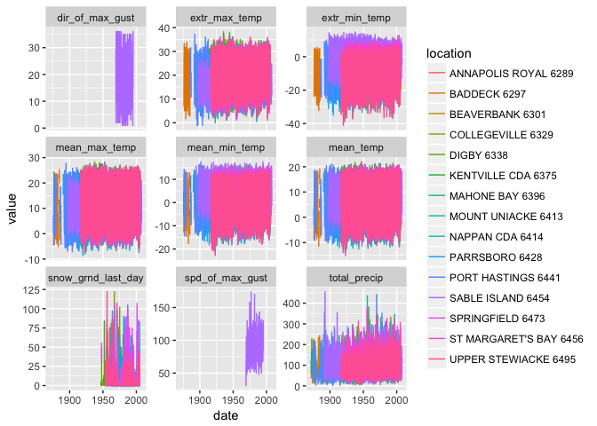
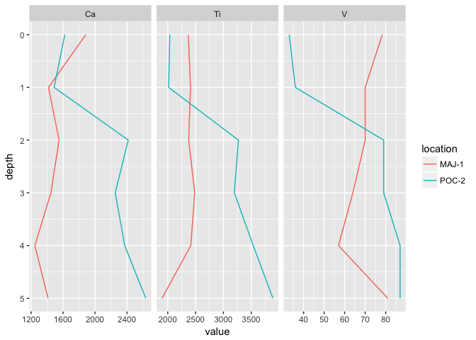

<!-- README.md is generated from README.Rmd. Please edit that file -->
mudata2
=======

[](https://cran.r-project.org/package=mudata2) [](https://travis-ci.org/paleolimbot/mudata) [](https://codecov.io/github/paleolimbot/mudata?branch=master)

The **mudata2** package provides tools to read, write, and add metadata to multi-parameter spatiotemporal data. The term "multi-parameter spatiotemporal data" is a mouthful, but all it means is that you measured a bunch of things (parameters) in a bunch of places (locations) at a bunch of different times. The best example of this is historical climate data, because it is usually set up in such a way that there are climate stations (locations) that measure some things (parameters, like temperature, precipitation, wind, etc.) at various points in time. This package is designed primarily for climate data and core data, however the format can be applied to many other types of data where parameters are measured along one or more common axes (time, depth, etc.).

Installation
------------

You can install mudata2 from github with:

``` r
# install.packages("devtools")
devtools::install_github("paleolimbot/mudata")
```

Using mudata objects
--------------------

The basic idea of a mudata object is to store data with embedded documentation. For example, the `ns_climate` dataset is a collection of monthly climate observations from [Nova Scotia](https://www.wikipedia.org/wiki/Nova_Scotia) (Canada), from [Environment Canada](http://climate.weather.gc.ca/). You can have a quick glance at the object using `print()`, `summary()` or `autoplot()`.

``` r
library(mudata2)
print(ns_climate)
#> A mudata object aligned along "date"
#>   distinct_datasets():  "ecclimate_monthly"
#>   distinct_locations(): ... 15 values
#>   distinct_params():    ... 11 values
#>   src_tbls():           ... 5 values
#> 
#> tbl_data() %>% head():
#> # A tibble: 6 x 7
#>             dataset          location         param       date value  flag
#>               <chr>             <chr>         <chr>     <date> <dbl> <chr>
#> 1 ecclimate_monthly SABLE ISLAND 6454 mean_max_temp 1897-01-01    NA     M
#> 2 ecclimate_monthly SABLE ISLAND 6454 mean_max_temp 1897-02-01    NA     M
#> 3 ecclimate_monthly SABLE ISLAND 6454 mean_max_temp 1897-03-01    NA     M
#> 4 ecclimate_monthly SABLE ISLAND 6454 mean_max_temp 1897-04-01    NA     M
#> 5 ecclimate_monthly SABLE ISLAND 6454 mean_max_temp 1897-05-01    NA     M
#> 6 ecclimate_monthly SABLE ISLAND 6454 mean_max_temp 1897-06-01    NA     M
#> # ... with 1 more variables: flag_text <chr>
summary(ns_climate)
#> # A tibble: 137 x 7
#>              param             location           dataset mean_value
#>              <chr>                <chr>             <chr>      <dbl>
#>  1 dir_of_max_gust    SABLE ISLAND 6454 ecclimate_monthly   19.77258
#>  2   extr_max_temp ANNAPOLIS ROYAL 6289 ecclimate_monthly   19.93257
#>  3   extr_max_temp         BADDECK 6297 ecclimate_monthly   18.85291
#>  4   extr_max_temp      BEAVERBANK 6301 ecclimate_monthly   17.22857
#>  5   extr_max_temp    COLLEGEVILLE 6329 ecclimate_monthly   20.33914
#>  6   extr_max_temp           DIGBY 6338 ecclimate_monthly   19.04834
#>  7   extr_max_temp   KENTVILLE CDA 6375 ecclimate_monthly   21.00661
#>  8   extr_max_temp      MAHONE BAY 6396 ecclimate_monthly   20.76598
#>  9   extr_max_temp   MOUNT UNIACKE 6413 ecclimate_monthly   19.67059
#> 10   extr_max_temp      NAPPAN CDA 6414 ecclimate_monthly   19.33575
#> # ... with 127 more rows, and 3 more variables: sd_value <dbl>, n <int>,
#> #   n_NA <int>
autoplot(ns_climate)
```



You can extract the data from the object using `tbl_data()` or `tbl_data_wide()`:

``` r
ns_climate %>% tbl_data()
#> # A tibble: 115,541 x 7
#>              dataset          location         param       date value
#>                <chr>             <chr>         <chr>     <date> <dbl>
#>  1 ecclimate_monthly SABLE ISLAND 6454 mean_max_temp 1897-01-01    NA
#>  2 ecclimate_monthly SABLE ISLAND 6454 mean_max_temp 1897-02-01    NA
#>  3 ecclimate_monthly SABLE ISLAND 6454 mean_max_temp 1897-03-01    NA
#>  4 ecclimate_monthly SABLE ISLAND 6454 mean_max_temp 1897-04-01    NA
#>  5 ecclimate_monthly SABLE ISLAND 6454 mean_max_temp 1897-05-01    NA
#>  6 ecclimate_monthly SABLE ISLAND 6454 mean_max_temp 1897-06-01    NA
#>  7 ecclimate_monthly SABLE ISLAND 6454 mean_max_temp 1897-07-01    NA
#>  8 ecclimate_monthly SABLE ISLAND 6454 mean_max_temp 1897-08-01    NA
#>  9 ecclimate_monthly SABLE ISLAND 6454 mean_max_temp 1897-09-01    NA
#> 10 ecclimate_monthly SABLE ISLAND 6454 mean_max_temp 1897-10-01  12.2
#> # ... with 115,531 more rows, and 2 more variables: flag <chr>,
#> #   flag_text <chr>
ns_climate %>% tbl_data_wide()
#> # A tibble: 14,311 x 14
#>              dataset             location       date dir_of_max_gust
#>  *             <chr>                <chr>     <date>           <dbl>
#>  1 ecclimate_monthly ANNAPOLIS ROYAL 6289 1914-01-01              NA
#>  2 ecclimate_monthly ANNAPOLIS ROYAL 6289 1914-02-01              NA
#>  3 ecclimate_monthly ANNAPOLIS ROYAL 6289 1914-03-01              NA
#>  4 ecclimate_monthly ANNAPOLIS ROYAL 6289 1914-04-01              NA
#>  5 ecclimate_monthly ANNAPOLIS ROYAL 6289 1914-05-01              NA
#>  6 ecclimate_monthly ANNAPOLIS ROYAL 6289 1914-06-01              NA
#>  7 ecclimate_monthly ANNAPOLIS ROYAL 6289 1914-07-01              NA
#>  8 ecclimate_monthly ANNAPOLIS ROYAL 6289 1914-08-01              NA
#>  9 ecclimate_monthly ANNAPOLIS ROYAL 6289 1914-09-01              NA
#> 10 ecclimate_monthly ANNAPOLIS ROYAL 6289 1914-10-01              NA
#> # ... with 14,301 more rows, and 10 more variables: extr_max_temp <dbl>,
#> #   extr_min_temp <dbl>, mean_max_temp <dbl>, mean_min_temp <dbl>,
#> #   mean_temp <dbl>, snow_grnd_last_day <dbl>, spd_of_max_gust <dbl>,
#> #   total_precip <dbl>, total_rain <dbl>, total_snow <dbl>
```

You can have a look at the embedded documentation using `tbl_params()`, `tbl_locations()`, `tbl_datasets()`, and `tbl_columns()`:

``` r
ns_climate %>% tbl_params()
#> # A tibble: 11 x 4
#>              dataset              param                      label
#>                <chr>              <chr>                      <chr>
#>  1 ecclimate_monthly      mean_max_temp          Mean Max Temp (C)
#>  2 ecclimate_monthly      mean_min_temp          Mean Min Temp (C)
#>  3 ecclimate_monthly          mean_temp              Mean Temp (C)
#>  4 ecclimate_monthly      extr_max_temp          Extr Max Temp (C)
#>  5 ecclimate_monthly      extr_min_temp          Extr Min Temp (C)
#>  6 ecclimate_monthly         total_rain            Total Rain (mm)
#>  7 ecclimate_monthly         total_snow            Total Snow (cm)
#>  8 ecclimate_monthly       total_precip          Total Precip (mm)
#>  9 ecclimate_monthly snow_grnd_last_day    Snow Grnd Last Day (cm)
#> 10 ecclimate_monthly    dir_of_max_gust Dir of Max Gust (10's deg)
#> 11 ecclimate_monthly    spd_of_max_gust     Spd of Max Gust (km/h)
#> # ... with 1 more variables: unit <chr>
ns_climate %>% tbl_locations()
#> # A tibble: 15 x 19
#>              dataset               location              name    province
#>                <chr>                  <chr>             <chr>       <chr>
#>  1 ecclimate_monthly   ANNAPOLIS ROYAL 6289   ANNAPOLIS ROYAL NOVA SCOTIA
#>  2 ecclimate_monthly           BADDECK 6297           BADDECK NOVA SCOTIA
#>  3 ecclimate_monthly        BEAVERBANK 6301        BEAVERBANK NOVA SCOTIA
#>  4 ecclimate_monthly      COLLEGEVILLE 6329      COLLEGEVILLE NOVA SCOTIA
#>  5 ecclimate_monthly             DIGBY 6338             DIGBY NOVA SCOTIA
#>  6 ecclimate_monthly     KENTVILLE CDA 6375     KENTVILLE CDA NOVA SCOTIA
#>  7 ecclimate_monthly        MAHONE BAY 6396        MAHONE BAY NOVA SCOTIA
#>  8 ecclimate_monthly     MOUNT UNIACKE 6413     MOUNT UNIACKE NOVA SCOTIA
#>  9 ecclimate_monthly        NAPPAN CDA 6414        NAPPAN CDA NOVA SCOTIA
#> 10 ecclimate_monthly         PARRSBORO 6428         PARRSBORO NOVA SCOTIA
#> 11 ecclimate_monthly     PORT HASTINGS 6441     PORT HASTINGS NOVA SCOTIA
#> 12 ecclimate_monthly      SABLE ISLAND 6454      SABLE ISLAND NOVA SCOTIA
#> 13 ecclimate_monthly ST MARGARET'S BAY 6456 ST MARGARET'S BAY NOVA SCOTIA
#> 14 ecclimate_monthly       SPRINGFIELD 6473       SPRINGFIELD NOVA SCOTIA
#> 15 ecclimate_monthly   UPPER STEWIACKE 6495   UPPER STEWIACKE NOVA SCOTIA
#> # ... with 15 more variables: climate_id <chr>, station_id <int>,
#> #   wmo_id <int>, tc_id <chr>, latitude <dbl>, longitude <dbl>,
#> #   elevation <dbl>, first_year <int>, last_year <int>,
#> #   hly_first_year <int>, hly_last_year <int>, dly_first_year <int>,
#> #   dly_last_year <int>, mly_first_year <int>, mly_last_year <int>
ns_climate %>% tbl_datasets()
#> # A tibble: 1 x 2
#>             dataset                           url
#>               <chr>                         <chr>
#> 1 ecclimate_monthly http://climate.weather.gc.ca/
ns_climate %>% tbl_columns()
#> # A tibble: 32 x 5
#>              dataset     table    column      type
#>                <chr>     <chr>     <chr>     <chr>
#>  1 ecclimate_monthly      data   dataset character
#>  2 ecclimate_monthly      data  location character
#>  3 ecclimate_monthly      data     param character
#>  4 ecclimate_monthly      data      date      date
#>  5 ecclimate_monthly      data     value    double
#>  6 ecclimate_monthly      data      flag character
#>  7 ecclimate_monthly      data flag_text character
#>  8 ecclimate_monthly locations   dataset character
#>  9 ecclimate_monthly locations  location character
#> 10 ecclimate_monthly locations      name character
#> # ... with 22 more rows, and 1 more variables: description <chr>
```

You can subset mudata objects using `select_params()`, `select_locations()`, and `select_datasets()`, which use **dplyr**-like selection syntax to quickly subset mudata objects.

``` r
ns_climate %>% 
  select_params(contains("temp"))
#> A mudata object aligned along "date"
#>   distinct_datasets():  "ecclimate_monthly"
#>   distinct_locations(): ... 15 values
#>   distinct_params():    ... 5 values
#>   src_tbls():           ... 5 values
#> 
#> tbl_data() %>% head():
#> # A tibble: 6 x 7
#>             dataset          location         param       date value  flag
#>               <chr>             <chr>         <chr>     <date> <dbl> <chr>
#> 1 ecclimate_monthly SABLE ISLAND 6454 mean_max_temp 1897-01-01    NA     M
#> 2 ecclimate_monthly SABLE ISLAND 6454 mean_max_temp 1897-02-01    NA     M
#> 3 ecclimate_monthly SABLE ISLAND 6454 mean_max_temp 1897-03-01    NA     M
#> 4 ecclimate_monthly SABLE ISLAND 6454 mean_max_temp 1897-04-01    NA     M
#> 5 ecclimate_monthly SABLE ISLAND 6454 mean_max_temp 1897-05-01    NA     M
#> 6 ecclimate_monthly SABLE ISLAND 6454 mean_max_temp 1897-06-01    NA     M
#> # ... with 1 more variables: flag_text <chr>
ns_climate %>% 
  select_locations(Kentville = starts_with("KENTVILLE"),
                   Sable = starts_with("SABLE"))
#> A mudata object aligned along "date"
#>   distinct_datasets():  "ecclimate_monthly"
#>   distinct_locations(): "Kentville", "Sable"
#>   distinct_params():    ... 11 values
#>   src_tbls():           ... 5 values
#> 
#> tbl_data() %>% head():
#> # A tibble: 6 x 7
#>             dataset location         param       date value  flag
#>               <chr>    <chr>         <chr>     <date> <dbl> <chr>
#> 1 ecclimate_monthly    Sable mean_max_temp 1897-01-01    NA     M
#> 2 ecclimate_monthly    Sable mean_max_temp 1897-02-01    NA     M
#> 3 ecclimate_monthly    Sable mean_max_temp 1897-03-01    NA     M
#> 4 ecclimate_monthly    Sable mean_max_temp 1897-04-01    NA     M
#> 5 ecclimate_monthly    Sable mean_max_temp 1897-05-01    NA     M
#> 6 ecclimate_monthly    Sable mean_max_temp 1897-06-01    NA     M
#> # ... with 1 more variables: flag_text <chr>
```

Finally, you can `filter()` individual tables using **dplyr**-like syntax (these functions also make sure all tables stay synced with each other):

``` r
library(lubridate)
#> 
#> Attaching package: 'lubridate'
#> The following object is masked from 'package:base':
#> 
#>     date
ns_climate %>%
  filter_data(month(date) == 6)
#> A mudata object aligned along "date"
#>   distinct_datasets():  "ecclimate_monthly"
#>   distinct_locations(): ... 15 values
#>   distinct_params():    ... 11 values
#>   src_tbls():           ... 5 values
#> 
#> tbl_data() %>% head():
#> # A tibble: 6 x 7
#>             dataset          location         param       date value  flag
#>               <chr>             <chr>         <chr>     <date> <dbl> <chr>
#> 1 ecclimate_monthly SABLE ISLAND 6454 mean_max_temp 1897-06-01    NA     M
#> 2 ecclimate_monthly SABLE ISLAND 6454 mean_max_temp 1898-06-01  13.4  <NA>
#> 3 ecclimate_monthly SABLE ISLAND 6454 mean_max_temp 1899-06-01  14.4  <NA>
#> 4 ecclimate_monthly SABLE ISLAND 6454 mean_max_temp 1900-06-01  14.6  <NA>
#> 5 ecclimate_monthly SABLE ISLAND 6454 mean_max_temp 1901-06-01  15.3  <NA>
#> 6 ecclimate_monthly SABLE ISLAND 6454 mean_max_temp 1902-06-01  13.6  <NA>
#> # ... with 1 more variables: flag_text <chr>
ns_climate %>%
  filter_locations(last_year > 2000)
#> A mudata object aligned along "date"
#>   distinct_datasets():  "ecclimate_monthly"
#>   distinct_locations(): ... 9 values
#>   distinct_params():    ... 11 values
#>   src_tbls():           ... 5 values
#> 
#> tbl_data() %>% head():
#> # A tibble: 6 x 7
#>             dataset          location         param       date value  flag
#>               <chr>             <chr>         <chr>     <date> <dbl> <chr>
#> 1 ecclimate_monthly SABLE ISLAND 6454 mean_max_temp 1897-01-01    NA     M
#> 2 ecclimate_monthly SABLE ISLAND 6454 mean_max_temp 1897-02-01    NA     M
#> 3 ecclimate_monthly SABLE ISLAND 6454 mean_max_temp 1897-03-01    NA     M
#> 4 ecclimate_monthly SABLE ISLAND 6454 mean_max_temp 1897-04-01    NA     M
#> 5 ecclimate_monthly SABLE ISLAND 6454 mean_max_temp 1897-05-01    NA     M
#> 6 ecclimate_monthly SABLE ISLAND 6454 mean_max_temp 1897-06-01    NA     M
#> # ... with 1 more variables: flag_text <chr>
```

Creating mudata objects
-----------------------

Objects are created using the `mudata()` function, which takes a data frame/tibble with columns (at least) `param` and `value`. If you have more than one location, you will need a `location` column, and if you have points measured at more than one time, you'll need a column that describes the point in time (probably called `date` or `datetime`, or if you're a [paleolimnologist](https://www.wikipedia.org/wiki/Paleolimnology) like me, `depth` and/or `age`).

As an example, we'll use a small subset of data from two cores I collected a long time ago:

``` r
library(tidyverse)
poc_maj <- pocmajsum %>%
  select(core, depth, Ca, Ti, V)
poc_maj
#> # A tibble: 12 x 5
#>     core depth       Ca       Ti        V
#>    <chr> <int>    <dbl>    <dbl>    <dbl>
#>  1 MAJ-1     0 1884.667 2369.667 78.33333
#>  2 MAJ-1     1 1418.000 2409.000 70.00000
#>  3 MAJ-1     2 1550.000 2376.000 70.00000
#>  4 MAJ-1     3 1448.000 2485.000 64.00000
#>  5 MAJ-1     4 1247.000 2414.000 57.00000
#>  6 MAJ-1     5 1412.333 1897.333 81.00000
#>  7 POC-2     0 1622.000 2038.000 33.00000
#>  8 POC-2     1 1488.000 2016.000 36.00000
#>  9 POC-2     2 2416.000 3270.000 79.00000
#> 10 POC-2     3 2253.000 3197.000 79.00000
#> 11 POC-2     4 2372.000 3536.000 87.00000
#> 12 POC-2     5 2635.333 3890.000 87.00000
```

Here, `depth` is the depth in the core, and `Ca`, `Ti`, and `V` are elemental concentrations in the sediment. To get this into parameter-long format, we need to use the `gather()` function in the **tidyr** package, and rename the `core` column to `location`.

``` r
poc_maj_long <- poc_maj %>%
  gather(Ca, Ti, V, key = "param", value = "value") %>%
  rename(location = core)
poc_maj_long
#> # A tibble: 36 x 4
#>    location depth param    value
#>       <chr> <int> <chr>    <dbl>
#>  1    MAJ-1     0    Ca 1884.667
#>  2    MAJ-1     1    Ca 1418.000
#>  3    MAJ-1     2    Ca 1550.000
#>  4    MAJ-1     3    Ca 1448.000
#>  5    MAJ-1     4    Ca 1247.000
#>  6    MAJ-1     5    Ca 1412.333
#>  7    POC-2     0    Ca 1622.000
#>  8    POC-2     1    Ca 1488.000
#>  9    POC-2     2    Ca 2416.000
#> 10    POC-2     3    Ca 2253.000
#> # ... with 26 more rows
```

This is the form of data needed by the `mudata()` constructor.

``` r
poc_maj_md <- mudata(poc_maj_long)
#> Guessing x columns: depth
autoplot(poc_maj_md, y = "depth") + scale_y_reverse()
#> Using x = "value"
```



More information
----------------

For more examples of `mudata` objects, see `alta_lake`, `long_lake`, and `kentvillegreenwood`. For more examples of mudata usage, see the package vignettes (coming soon...).
